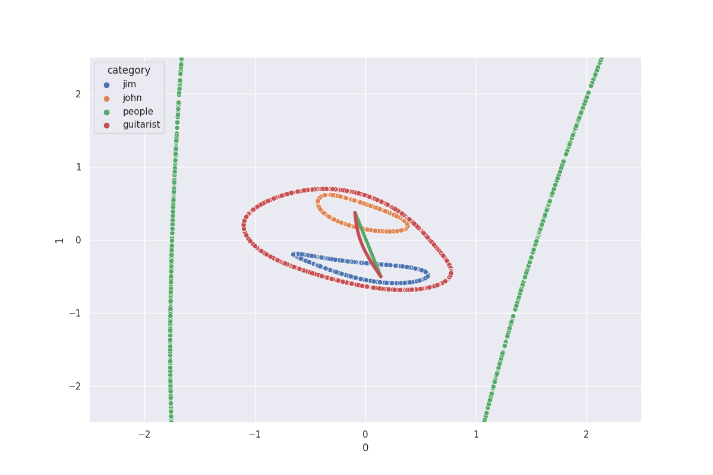

# Conceptual Representations with Manifolds

This repository has simple examples for conceptual manifolds.
Each script in the root directory consists of an example scenario, along with different meaning postulates.
The postulates are written in a compositional fuzzy logic which then can have gradient descent applied to it.
Finally, the scripts each produce different figures.

For example, `jim_and_john_similar.py` describes a scenario where Jim and John are both guitarists and people.
They are similar people, but not similar guitarists and so the distance between them is greater along the guitarist manifold than the people manifold.

